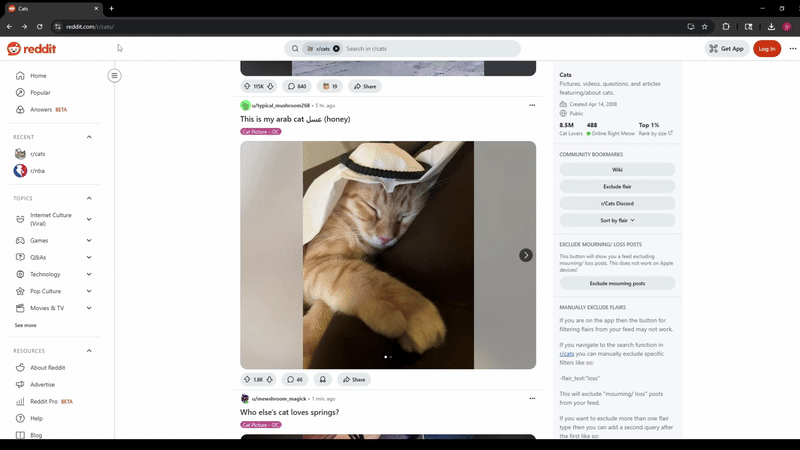

# LinkNest - Bookmark Manager

**LinkNest** is a Chrome Extension that replaces the default bookmark manager with a fast, light-weight, and visually organized alternative. It allows users to create, tag, edit, search, and delete bookmarks directly from a polished UI popup.

With support for custom tagging (including predefined and custom tags), real-time editing, dark theme design, and instant filtering through a search bar, **LinkNest** is ideal for power users who want more control over their saved links.

---

### 🛠️ Built With

- **React + Vite** – Fast and modern UI development
- **Chrome Extensions API** – Bookmark manipulation and messaging
- **Local Storage** – Persisting bookmark tags via `chrome.storage.local`
- **Custom SVG Icons** – Icons for editing and deleting
- **Modern CSS** – Clean, responsive dark-mode styling

---
## Privacy Policy
LinkNest does not collect, store, or transmit any user data. All bookmarks and interactions remain entirely local to your browser.

---
### ✅ User Stories

The following **required** functionality is implemented:

- ✅ User can **create a new bookmark** through a popup with fields for title, URL, and tags  
- ✅ User can **assign a predefined or custom tag** to each bookmark (limited to 3 words)  
- ✅ User can **search** for bookmarks via a search bar with real-time filtering  
- ✅ User can **edit title, tag, or URL** of any saved bookmark using an inline form  
- ✅ User can **cancel edits** or click the pencil icon again to exit edit mode  
- ✅ User can **delete a bookmark** via a trash icon  
- ✅ A white ❌ **clear icon** exists at the end of the search bar to reset the query  
- ✅ UI consistently maintains **dark theme** with colored tag labels

---

### Optional Features

- ✅ Predefined tag dropdown with color-coded labels (e.g. `work`, `videos`, `school`)  
- ✅ Auto appends new bookmarks from other tabs via `chrome.runtime.onMessage`  
- ✅ Shows **pencil icon** for editing and **trash icon** for deletion next to each bookmark  
- ✅ Custom popup size with fixed width and scrollable height  
- ✅ All inputs and tag dropdowns are uniformly sized for visual consistency  

---

### Additional Features

- ✅ **Custom emoji** used for branding inside the popup (📝 LN icon in header)  
- ✅ Styled header with logo and `"LinkNest - Bookmark Manager"` title  
- ✅ Clean tab spacing, margin alignment, and consistent field widths  
- ✅ Optional fields (e.g., custom tag input) dynamically appear when needed  
- ✅ Fully functional even if default Chrome Bookmark Manager is bypassed  

---

> All data (including tags) is stored using `chrome.storage.local` and synced with Chrome Bookmarks for a seamless experience.

<h2>Extension Demo</h2>

  

